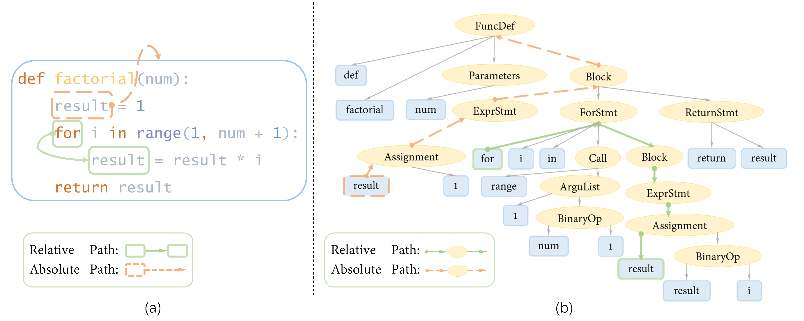

This is an official Pytorch implementation of the approaches proposed in:
> Han Peng, Ge Li, Wenhan Wang, Yunfei Zhao, Zhi Jin *“Integrating Tree Path in Transformer for Code Representation”* 

which appeared at **NeurIPS 2021**

In this paper, we investigate the interaction between the absolute and relative path encoding, 
and propose novel code representation model _TPTrans_ and its variants, which introduce path encoding inductive bias 
into the attention module of Transformer and power Transformer to know the structure of source codes.




Please cite our paper if you use the model, experimental results, or our code in your own work.


## 1.1 Raw data
To run experiments with _TPTrans_ and its variants, please first create datasets from raw code snippets of [CodeSearchNet dataset](https://github.com/github/CodeSearchNet).
Download and unzip the raw jsonl data of CSN into the _raw_data_ dir like that

```yaml
├── raw_data        
│   ├── python         
│   │   ├── train    
│   │   │   ├── XXXX.jsonl...
│   │   ├── test    
│   │   ├── valid   
│   ├── ruby          
│   ├── go        
│   ├── javascript        
```

## 1.2 Tree-Sitter
The [Tree-Sitter](https://github.com/tree-sitter/tree-sitter) is a open-source parser for multi-language programming languages.
Please install it and then download the grammer files into _vendor_ dir for four different programming languages like that

```yaml
├── vendor        
│   ├── tree-sitter-python  (from https://github.com/tree-sitter/tree-sitter-python)         
│   ├── tree-sitter-javascript  (from https://github.com/tree-sitter/tree-sitter-javascript)     
│   ├── tree-sitter-go  (from https://github.com/tree-sitter/tree-sitter-go)
│   ├── tree-sitter-ruby  (from https://github.com/tree-sitter/tree-sitter-ruby)

```
After that, run the _multi_language_parse.py_ in _parser_ dir to parse the raw code snippets into the _data_ dir.

## 1.3 Training

After preprocessing, run the _\_main.py__ to train the model.

To run the _TPTrans_, please specify the _relation_path=True_ and _absolute_path=False_.

To run the _TPTrans-\alpha_, please specify the _relation_path=True_ and _absolute_path=True_.

For other command triggers, please refer the comment inline for details. 

**Contact**
If you have any questions, please contact me via email: phan@pku.edu.cn or open issue on Github.